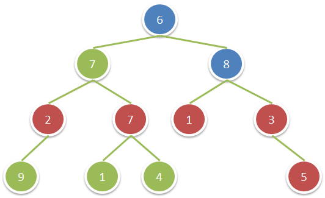

给你一棵二叉树，请你返回满足以下条件的所有节点的值之和：

该节点的祖父节点的值为偶数。（一个节点的祖父节点是指该节点的父节点的父节点。）
如果不存在祖父节点值为偶数的节点，那么返回 0 。

 

示例：



输入：root = [6,7,8,2,7,1,3,9,null,1,4,null,null,null,5]
输出：18
解释：图中红色节点的祖父节点的值为偶数，蓝色节点为这些红色节点的祖父节点。


提示：

树中节点的数目在 1 到 10^4 之间。
每个节点的值在 1 到 100 之间。

```c++
/**
 * Definition for a binary tree node.
 * struct TreeNode {
 *     int val;
 *     TreeNode *left;
 *     TreeNode *right;
 *     TreeNode() : val(0), left(nullptr), right(nullptr) {}
 *     TreeNode(int x) : val(x), left(nullptr), right(nullptr) {}
 *     TreeNode(int x, TreeNode *left, TreeNode *right) : val(x), left(left), right(right) {}
 * };
 */
class Solution {
public:
    int result=0;

    int sumEvenGrandparent(TreeNode* root) {
        if(root==NULL){
            return 0;
        }
        traverse(root);
        return result;
    }

    void traverse(TreeNode* root){
        if(root==NULL){
            return;
        }
        traverse(root->left);
        traverse(root->right);
        if(root->val%2==0){
            result+=find(root);
        }
    }

    int find(TreeNode* root){
        int res=0;
        if(root->left!=NULL){
            if(root->left->left!=NULL){
                res+=root->left->left->val;
            }
            if(root->left->right!=NULL){
                res+=root->left->right->val;
            }
        }
        if(root->right!=NULL){
            if(root->right->left!=NULL){
                res+=root->right->left->val;
            }
            if(root->right->right!=NULL){
                res+=root->right->right->val;
            }
        }
        return res;
    }
};
```

