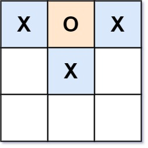

给你一个字符串数组 board 表示井字游戏的棋盘。当且仅当在井字游戏过程中，棋盘有可能达到 board 所显示的状态时，才返回 true 。

井字游戏的棋盘是一个 3 x 3 数组，由字符 ' '，'X' 和 'O' 组成。字符 ' ' 代表一个空位。

以下是井字游戏的规则：

玩家轮流将字符放入空位（' '）中。
玩家 1 总是放字符 'X' ，而玩家 2 总是放字符 'O' 。
'X' 和 'O' 只允许放置在空位中，不允许对已放有字符的位置进行填充。
当有 3 个相同（且非空）的字符填充任何行、列或对角线时，游戏结束。
当所有位置非空时，也算为游戏结束。
如果游戏结束，玩家不允许再放置字符。

示例 1：


输入：board = ["O  ","   ","   "]
输出：false
解释：玩家 1 总是放字符 "X" 。
示例 2：



输入：board = ["XOX"," X ","   "]
输出：false
解释：玩家应该轮流放字符。
示例 3:


输入：board = ["XOX","O O","XOX"]
输出：true


提示：

board.length == 3
board[i].length == 3
board[i][j] 为 'X'、'O' 或 ' '

```c++
class Solution {
public:
    bool validTicTacToe(vector<string>& board) {
        int cnt = 0, w[128]{};
        for(auto&& s: board) for(char c: s) cnt += c == 'O' ? -1 : c == 'X';
        for(int i = 0; i < 3; ++i){
            ++w[board[i][0] | board[i][1] | board[i][2]];
            ++w[board[0][i] | board[1][i] | board[2][i]];    
        }
        ++w[board[0][0] | board[1][1] | board[2][2]];
        ++w[board[0][2] | board[1][1] | board[2][0]]; 
        return cnt == 1 && !w['O'] || cnt == 0 && !w['X'];
    }
};
```

```java
class Solution {
    public boolean validTicTacToe(String[] board) {
        int xCount = 0, oCount = 0;
        for (String row : board) {
            for (char c : row.toCharArray()) {
                xCount = (c == 'X') ? (xCount + 1) : xCount;
                oCount = (c == 'O') ? (oCount + 1) : oCount;
            } 
        }
        return !((oCount != xCount && oCount != xCount - 1) ||
               (oCount != xCount - 1 && win(board, 'X')) ||
               (oCount != xCount && win(board, 'O')));
    }

    public boolean win(String[] board, char p) {
        for (int i = 0; i < 3; ++i) {
            if ((p == board[0].charAt(i) && p == board[1].charAt(i) && p == board[2].charAt(i)) ||
               (p == board[i].charAt(0) && p == board[i].charAt(1) && p == board[i].charAt(2))) {
                return true;
            }
        }
        return ((p == board[0].charAt(0) && p == board[1].charAt(1) && p == board[2].charAt(2)) ||
                (p == board[0].charAt(2) && p == board[1].charAt(1) && p == board[2].charAt(0)));
    }
}
```

